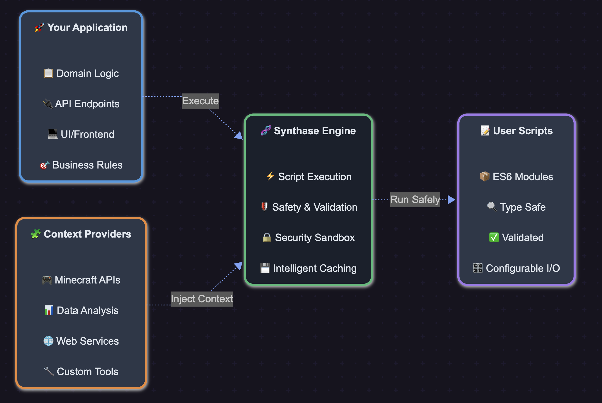

# 🧬 Synthase

**A powerful, safe, and extensible script execution engine with injectable context providers**

Synthase is a TypeScript/JavaScript execution engine designed for running user-generated scripts safely with rich context injection, comprehensive validation, and intelligent caching. Perfect for building scriptable applications, automation platforms, and domain-specific tools.

## ✨ Key Features

- 🛡️ **Safe Execution** - Comprehensive script validation, execution limits, and resource monitoring
- 🧩 **Injectable Context** - Modular context providers for different domains (Minecraft, data analysis, web APIs, etc.)
- ⚡ **High Performance** - Intelligent caching, dependency resolution, and optimized execution
- 📝 **Rich Type System** - Enhanced parameter definitions with validation, defaults, and conditional visibility
- 🔄 **Hot Reloading** - Dynamic script reloading for development workflows
- 📦 **Dependency Management** - Script registries and dynamic imports with safety checks
- 🔧 **Highly Configurable** - Execution limits, resource monitoring, and caching policies

## 🚀 Quick Start

### Installation

```bash
npm install synthase
# or
bun add synthase
```

### Basic Usage

```typescript
import { execute } from "synthase";

const script = `
export const io = {
  inputs: {
    name: { type: 'string', default: 'World' },
    count: { type: 'int', default: 3, min: 1, max: 10 }
  },
  outputs: {
    message: { type: 'string' }
  }
};

export default async function({ name, count }, { Logger }) {
  Logger.info(\`Greeting \${name} \${count} times\`);
  const message = Array(count).fill(\`Hello, \${name}!\`).join(' ');
  return { message };
}`;

const result = await execute(script, { name: "Synthase", count: 2 });
console.log(result.message); // "Hello, Synthase! Hello, Synthase!"
```

## 🧩 Injectable Context Architecture

Synthase's power comes from its injectable context system. Instead of hardcoding dependencies, you inject context providers for different domains:

### Data Analysis Context Example

```typescript
const dataContext = {
	Statistics: {
		mean: (values: number[]) =>
			values.reduce((a, b) => a + b, 0) / values.length,
		median: (values: number[]) => {
			const sorted = [...values].sort((a, b) => a - b);
			const mid = Math.floor(sorted.length / 2);
			return sorted.length % 2
				? sorted[mid]
				: (sorted[mid - 1] + sorted[mid]) / 2;
		},
	},
	DataProcessing: {
		normalize: (values: number[]) => {
			const max = Math.max(...values);
			const min = Math.min(...values);
			return values.map((v) => (v - min) / (max - min));
		},
	},
};

const analysisScript = `
export const io = {
  inputs: {
    dataset: { type: 'array' }
  },
  outputs: {
    summary: { type: 'object' }
  }
};

export default async function({ dataset }, { Statistics, DataProcessing }) {
  const values = dataset.map(item => item.value);
  
  return {
    summary: {
      mean: Statistics.mean(values),
      median: Statistics.median(values),
      normalized: DataProcessing.normalize(values)
    }
  };
}`;

const data = [{ value: 10 }, { value: 20 }, { value: 30 }];
const result = await execute(
	analysisScript,
	{ dataset: data },
	{ contextProviders: dataContext }
);
```

## 📝 Script Format

Synthase scripts are ES6 modules with two required exports:

### IO Schema Definition

```typescript
export const io = {
	inputs: {
		// Simple type definition
		message: { type: "string", default: "Hello" },

		// Advanced parameter with validation
		count: {
			type: "int",
			default: 1,
			min: 1,
			max: 100,
			description: "Number of repetitions",
		},

		// Conditional parameter
		advanced: { type: "boolean", default: false },
		threshold: {
			type: "float",
			default: 0.5,
			dependsOn: { advanced: true }, // Only show if advanced = true
		},

		// Options/enum
		mode: {
			type: "string",
			default: "fast",
			options: ["fast", "balanced", "quality"],
		},
	},
	outputs: {
		result: { type: "string" },
		metadata: { type: "object" },
	},
};
```

### Function Definition

```typescript
export default async function (inputs, context) {
	// inputs: validated parameters with defaults applied
	// context: injected dependencies + base context (Logger, Calculator, Utils, importScript)

	const { message, count } = inputs;
	const { Logger, Calculator } = context;

	Logger.info(`Processing: ${message}`);

	return {
		result: message.repeat(count),
		metadata: { timestamp: new Date().toISOString() },
	};
}
```

## 🛡️ Safety & Validation

Synthase includes comprehensive safety features:

### Script Validation

- **Syntax checking** - Validates ES6 module syntax
- **Security scanning** - Detects dangerous patterns (eval, infinite loops, etc.)
- **IO schema validation** - Ensures proper input/output definitions
- **Dependency analysis** - Tracks and validates script imports

### Runtime Safety

- **Execution timeouts** - Configurable max execution time
- **Memory monitoring** - Tracks and limits memory usage
- **Import limits** - Prevents import bombs and recursion
- **Resource monitoring** - Real-time resource usage tracking

### Input Validation

- **Type checking** - Validates parameter types and ranges
- **Default values** - Applies defaults for missing parameters
- **Conditional parameters** - Shows/hides parameters based on dependencies

## ⚡ Advanced Features

### Reusable Instances

```typescript
import { createReusable } from "synthase";

const reusable = await createReusable(script, { contextProviders });

// Execute multiple times with different inputs
const result1 = await reusable.execute({ name: "Alice" });
const result2 = await reusable.execute({ name: "Bob" });

reusable.dispose(); // Clean up resources
```

### Script Registries

```typescript
import { InMemoryScriptRegistry, HttpScriptRegistry } from "synthase";

// In-memory registry
const registry = new InMemoryScriptRegistry();
registry.register("helper-script", helperScriptContent);

// HTTP registry for loading from URLs
const httpRegistry = new HttpScriptRegistry("https://my-scripts.com/");

// Use with Synthase
const result = await execute(mainScript, inputs, {
	registry,
	contextProviders,
});
```

### Hot Reloading

```typescript
import { createHotReloadable } from "synthase";

const getScript = () => fs.readFileSync("script.js", "utf8");
const hotReloadable = await createHotReloadable(getScript);

// Execute
let result = await hotReloadable.execute(inputs);

// Reload when file changes
await hotReloadable.reload();
result = await hotReloadable.execute(inputs); // Uses updated script
```

### Caching Configuration

```typescript
const result = await execute(script, inputs, {
	contextProviders,
	cachePolicy: {
		maxAge: 10 * 60 * 1000, // 10 minutes
		maxSize: 50, // max 50 cached scripts
	},
});
```

## 🔧 Configuration Options

```typescript
interface SynthaseConfig {
	// Script registry for dependency resolution
	registry?: ScriptRegistry;

	// Execution limits
	limits?: {
		timeout?: number; // Max execution time (default: 30s)
		maxRecursionDepth?: number; // Max import depth (default: 10)
		maxImportedScripts?: number; // Max imported scripts (default: 50)
		maxMemory?: number; // Max memory usage (default: 100MB)
	};

	// Resource monitoring
	resourceMonitor?: {
		maxMemory?: number; // Memory limit
		checkIntervalMs?: number; // Monitoring interval
	};

	// Cache policy
	cachePolicy?: {
		maxAge?: number; // Cache TTL
		maxSize?: number; // Max cached scripts
	};

	// Injectable context providers
	contextProviders?: ContextProvider;
}
```

## 📚 API Reference

### Core Functions

#### `execute(script, inputs, config?)`

Execute a script once with given inputs.

#### `executeWithValidation(script, inputs, config?)`

Execute with enhanced input validation against IO schema.

#### `validate(script, config?)`

Validate script without executing - returns IO schema and dependencies.

#### `executeBatch(scripts, config?)`

Execute multiple scripts in sequence.

### Synthase Class

#### `new Synthase(script, config?)`

Create a reusable Synthase instance.

#### `synthase.call(inputs)`

Execute the script with given inputs.

#### `synthase.getIO()`

Get the script's IO schema.

#### `synthase.reload()`

Reload the script (for hot reloading).

#### `synthase.dispose()`

Clean up resources.

### Utilities

#### `createReusable(script, config?)`

Create a reusable script executor.

#### `createHotReloadable(getScript, config?)`

Create a hot-reloadable script executor.

#### `benchmark(script, inputs, iterations?, config?)`

Benchmark script performance.

## 🏗️ Architecture



## 🤝 Contributing

1. **Fork the repository**
2. **Create a feature branch**: `git checkout -b feature/amazing-feature`
3. **Make your changes** with tests
4. **Run the test suite**: `bun test`
5. **Submit a pull request**

### Development Setup

```bash
git clone https://github.com/Nano112/synthase.git
cd synthase
bun install
bun run build
```

### Development API Server

```bash
cd dev-api
bun install
bun run dev
```

Visit `http://localhost:3001` for the interactive test interface.

**Built with ❤️**
